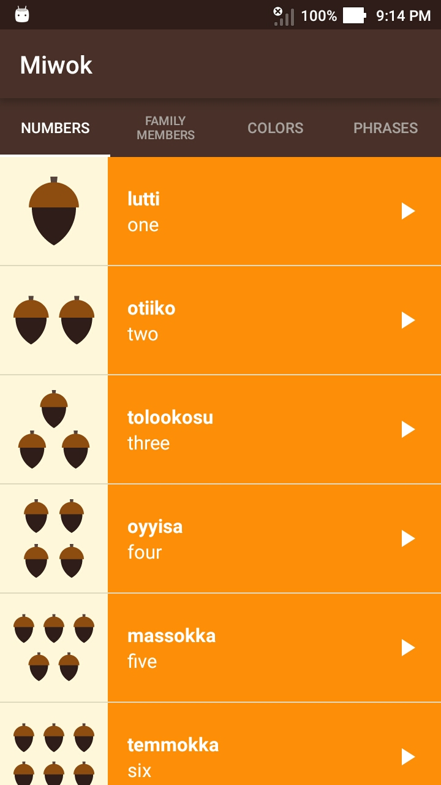
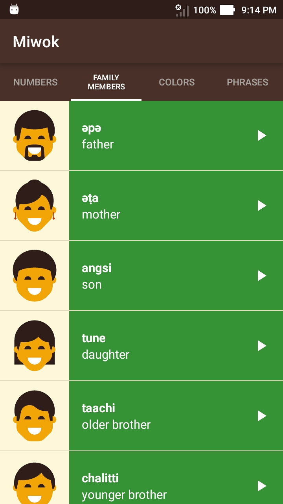
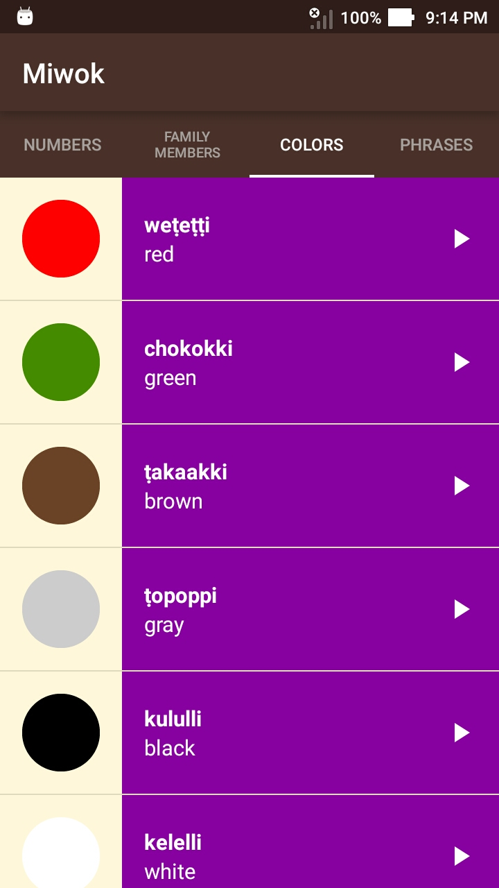
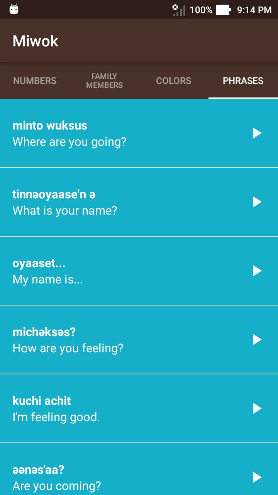

### Udacity Android Basics: Multiscreen Apps
#### Miwok App

This app displays lists of vocabulary words for the user to learn the Miwok language.
Used in a Udacity course in the Beginning Android Nanodegree.

